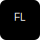

<h1 align="center">Hello World, I'm <a href="#" target="_blank">Artur!</a>
</h1>
<h3 align="center">A passionate backend developer</h3>

  

### Connect with me :
 
  

<h3 align="left">Languages and Tools:</h3>

 
  
  
  
  
  
  
  
  
  
  
  
  
  
  
  

